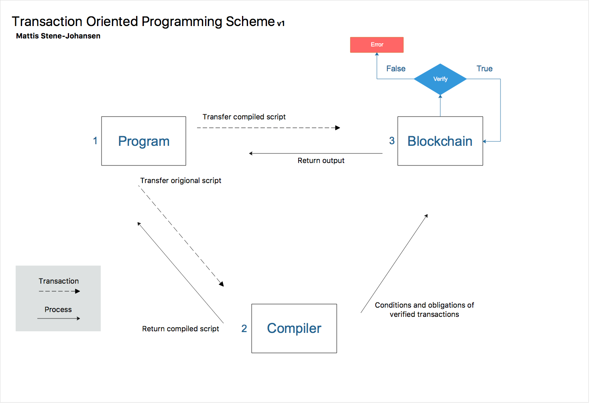

## Index

- Abstract
- History
- Design
  - Scheme
- Advantages
  - Use Cases
- Influences
- Language Support
- Conclusion

## Abstract

Transaction Oriented Programming (ToP) is an [approach to designing software](https://en.wikipedia.org/wiki/Programming_paradigm). It describes that software designers should define formal, precise and verifiable ___ for software components, which extend the ordinary definition of abstract data types with preconditions, postconditions and invariants. These specifications are referred to as "transactions", in accordance with a [interface specification](https://en.wikipedia.org/wiki/Application_Interface_Specification#Programming_model) with the conditions and obligations of [financial transactions](https://en.wikipedia.org/wiki/Financial_transaction).

## History

...

## Design

> if the picture doesn't show, click [here](https://github.com/mattisstenejohansen/mattisstenejohansen.github.io/master/_posts/assets/ToP-scheme.png)

The ToP scheme is based on a [Three-Party Card Scheme ](https://en.wikipedia.org/wiki/Card_scheme). 

An [acquirer](https://en.wikipedia.org/wiki/Acquiring_bank) (the compiler) processes program compiling on behalf of the merchant (the blockchain) based on the input of the cardholder (the program/script). The compiler allows the blockchain to accept transactions from the program. 

In this model, the issuer (having the relationship with the cardholder) and the acquirer (having the relationship with the merchant) is the same entity.

The blockchain verifies the program transaction based on the conditions and obligations of the compiler.

## Advantages

#### Use Cases

## Influences

- Design by Contract [[1](https://en.wikipedia.org/wiki/Design_by_contract)]
- Card Scheme [[2](https://en.wikipedia.org/wiki/Card_scheme)]
- Financial Transactions [[3](https://en.wikipedia.org/wiki/Financial_Transaction)]

